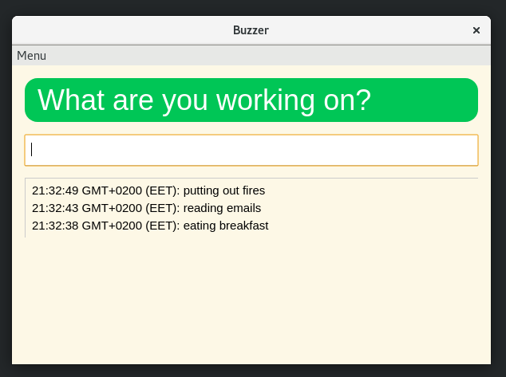

# taskmaster

Simple time tracking tool



## Installation & Usage

```
npm install
npm start
```

Write what you are doing and press enter to log it. The output is also
logged to `worklog.txt` in the current working directory.
